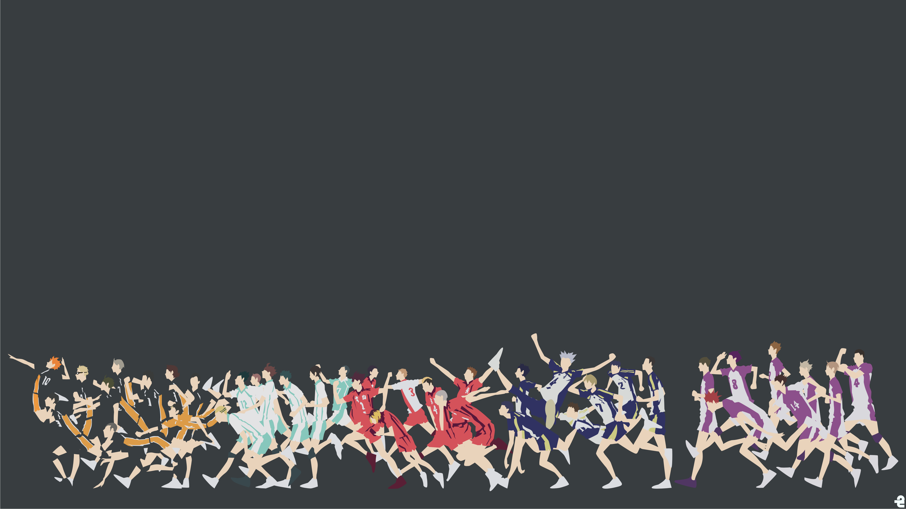
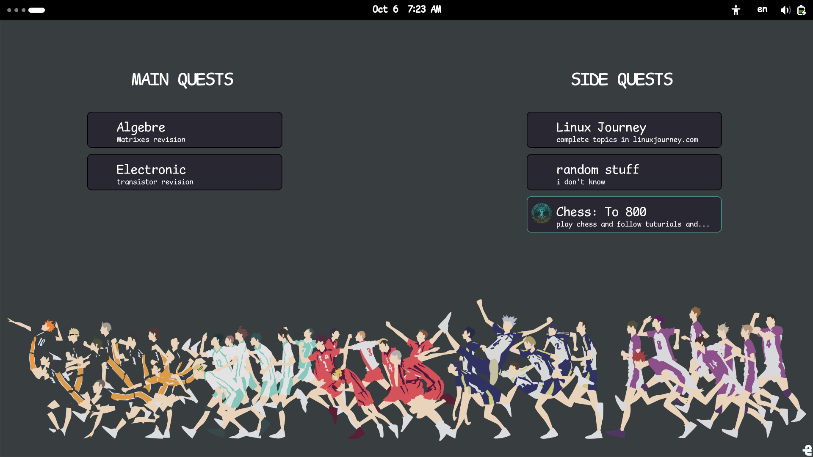

# Gaol_Screener
a simple python app built with pyqt and pillow to boost your production 
by visualzing your goals/quests in the home background and tracking them
(Inspired by AC valhalla quest menu BTW)
 ## Note
 recommanded image size : 3840*2160
 for linux machines, this app will work only on GTK-based DE (desktop enviroments)
 ## Example
 if this is your desktop background:
 
 
 
 then it will look like this, note that your background img should be clean to make good effect.
 (the little green icon points to the tracked quest)
 
 
 
 ## Start
 clone the repo: 
  	
   	git clone https://github.com/L4z3x/goal_screener/
    cd goal_screener
 ## install dependecies:
 ### linux
 debian:
              
    sudo apt install python3-pil python3-pyqt5

 arch:
    
    sudo pacman -S python-pil python-pyqt5
 ### windows

    pip install PyQt5 pillow
    
 ## Linux (gtk-based DE)   
   ### Arch-Based Distros:
      sudo pacman -U goalScreener-1.0-1-x86_64.pkg.tar.zst

   ### Debian-Based Distros:
      dpkg -i goalScreener.deb
   
## Windows
 run the app Win_app/goalScreener
 and it would be better to create a shortcut 

## NOTE(linux):
if the wallpaper does't seem to be set try running:

    gsettings get org.gnome.desktop.background picture-uri
then take the output and run the following:
    
    gsettings set org.gnome.desktop.background picture-uri-dark (your output url)

or if you don't use dark mode:

    gsettings set org.gnome.desktop.background picture-uri (your output url)

    
