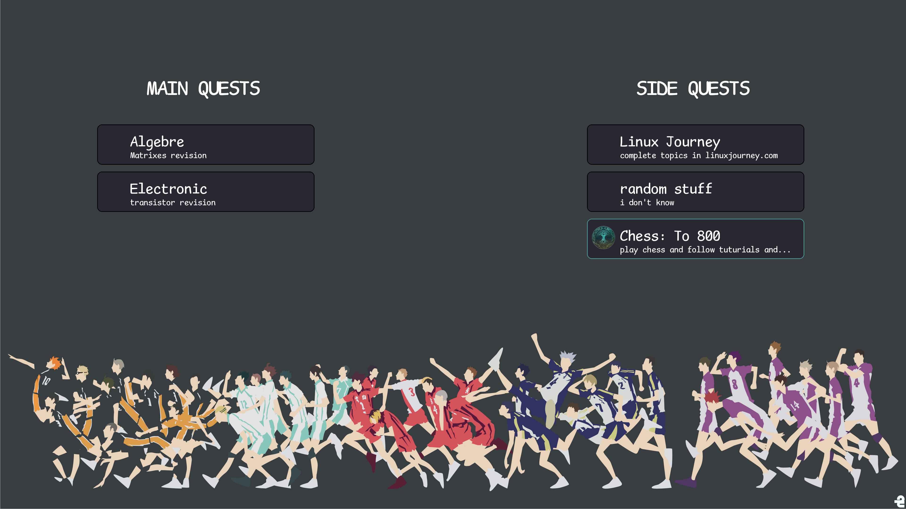

# Gaol_Screener
a simple python app built with pyqt and pillow to boost your production 
by visualzing your goals/quest in the home background and tracking them
 ## Example
 if this is your desktop background:
 
 
 
 then it will look like this, note that your background img should be clean to make good effect.
 (the little green icon points to the tracked quest)
 
 
 
 ## Start
 clone the repo: 
  	
   	git clone https://github.com/L4z3x/goal_screener/
    
 execute the script init.sh:
 	
  	./init.sh
 run the app:
 	
  	sudo python app.py

